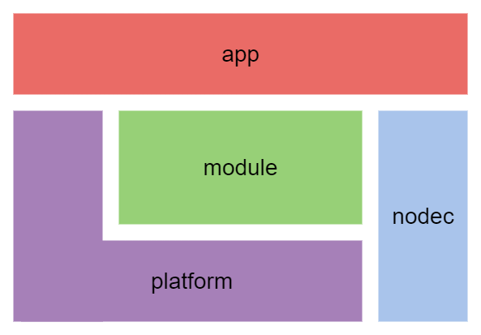

# nodec

English | [日本語](./README_jp.md)

`nodec` is the framework for creating a new platform (like game engine).

There have been many platforms for application development.
For example, there is Qt for creating GUI application and Unity for game development.
However, these platforms are developed individually,
and the app code that runs on them has a complementary different aspect.

The `nodec` framework allows you to build new platforms efficiently.
The `nodec` framework provides functionalities that can be commonly used across different platforms.
In addition, interfaces to applications are predefined, allowing reuse of architectures.

The implementation of application code can also be made efficient with the `nodec` framework.
There is a layer (called `modules`) on the platform that abstracts functionality.
The application layer uses the functionality of the platform through this layer.
Event if the platform is different, the implementation of app is the same.

## Architecture

### nodec

The basic library independent of the platforms.

### modules

The application interface for apps.
It is middle layer between the apps and platforms.

The modules's features need to be implemented by platforms.

### platforms

The base system for consisting the apps, having the program entry.

It is familiar with OS and SDKs.

### apps

The application layer, consisting on the modules and platforms.

## Projects

The list of projects using `nodec` framework.

### `nodec_game_engine`

<https://github.com/ContentsViewer/nodec_game_engine>

## Requirements

* C++17
