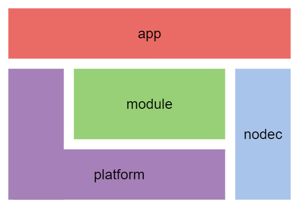

# nodec

[English](./README.md) | 日本語

`nodec`は、ゲームエンジンなどのプラットフォームを新しく作成するためのフレームワークです。

アプリ開発のためのプラットフォームは、これまでたくさんありました。
たとえば、GUIアプリケーション作成のプラットフォームにはQt、ゲーム開発のためのプラットフォームにはUnityがあります。
ですが、これらのプラットフォームは別々で開発されており、そのうえで動くアプリコードもまた、まったく違った様相をしています。

`nodec`フレームワークを利用することで、新しいプラットフォームを効率的に構築できます。
`nodec`フレームワークは、異なるプラットフォーム間で共通に使える機能を提供します。また、アプリへのインターフェイスはあらかじめ定義されているので、設計の再利用が可能です。

アプリコードの実装も、`nodec`フレームワークで効率化することが可能です。
プラットフォームの上に、機能を抽象化したレイヤー(modules)があり、
アプリ層はこのレイヤーを通してプラットフォームの機能を利用します。
プラットフォームが異なっても、アプリでの実装の仕方は同じです。

## 構成

### nodec

プラットフォームに依存しない基本的なライブラリ群。

### modules

アプリ層に提供するインターフェイスを定義している。
アプリ層とプラットフォーム層の中間に位置する。

モジュールの機能は、プラットフォーム層で実装される。

### platforms

アプリ層を成り立たせるための基礎となるシステムでプログラムエントリを持つ。

OSやSDKと仲がいい。

### apps

プラットフォームとモジュールの上にあるアプリケーション層。

## プロジェクト

`nodec`フレームワークを用いて作られたプロジェクト一覧。

### `nodec_game_engine`

<https://github.com/ContentsViewer/nodec_game_engine>

## 必須環境

* C++14
